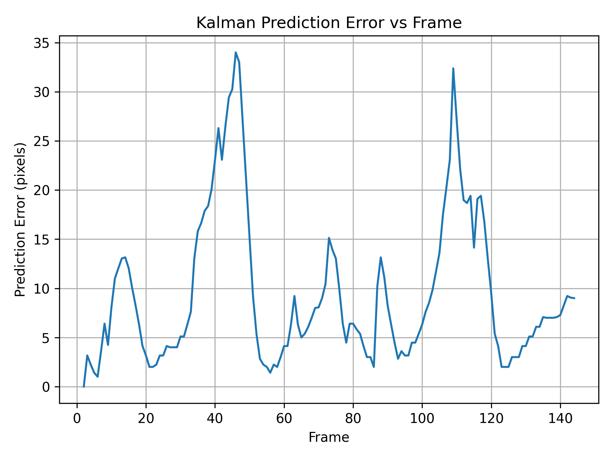
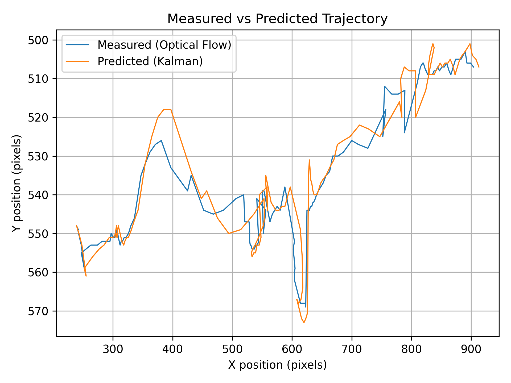
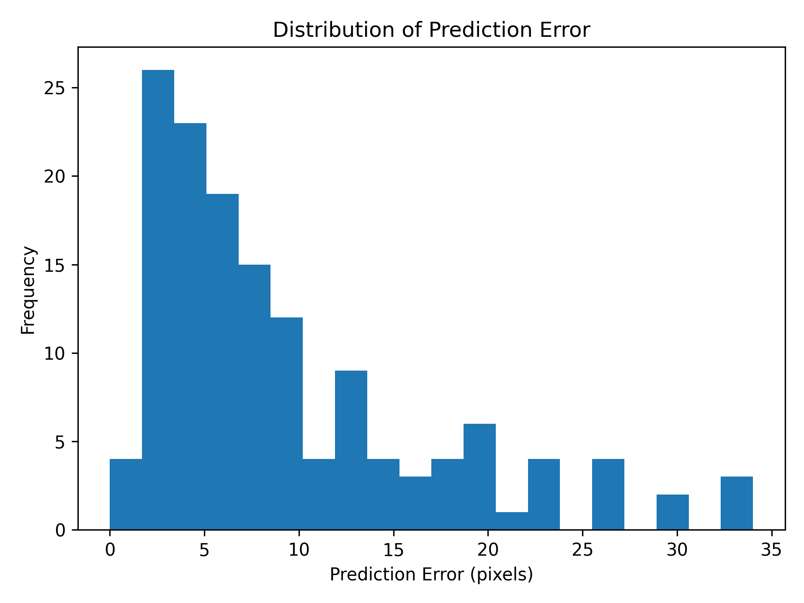

# Real-Time Human Motion Tracking for Robotics & Surveillance  
[]()  
[]()  
[]()  
[]()

## Project Link  
https://github.com/Gaurika-Sethi/Vision-Based-Object-Tracking-Motion-Prediction-for-Autonomous-Robots

---

## Overview  
This project implements a **real-time vision pipeline** that detects, tracks, and **predicts future positions** of a walking human from a static monocular camera. The pipeline integrates:

- Background subtraction for foreground detection  
- Lucas–Kanade optical flow for motion tracking  
- A **4-state constant-velocity Kalman filter** for forward motion prediction  

It demonstrates how **classical, explainable algorithms** can effectively handle motion tracking and prediction — ideal for **defence labs, robotics navigation**, and **autonomous surveillance** applications.

---

## 🛠️ System Architecture & Workflow

Video Input
```bash
└──> Person Detection (Background Subtraction + Contour)
└──> Bounding Box
└──> Optical Flow Feature Tracking
└──> Pseudo-centroid trajectory
└──> Kalman Filter Prediction (x, y, vx, vy)
└──> Future position prediction + logging + visualisation
```

### Components:

- **Detection** — MOG2 background subtraction + contour detection to localize person per frame  
- **Tracking** — Shi-Tomasi + Lucas–Kanade optical flow to get stable motion centroids  
- **Prediction** — Kalman filter initialized from first valid measurement; outputs future positions  
- **Visualization + Logging** — measurement + prediction logged; plotted and exported  

---

## 📊 Results & Visual Demonstrations

- **🟥 Red line** — measured trajectory (optical flow)  
- **🔵 Blue line** — predicted trajectory (Kalman filter)  

Results (in `results/`):  
- `measured_vs_predicted_scatter.png` — 2D trajectory comparison  
- `error_vs_frame_plot.png` — prediction error (pixel distance) over time  
- `error_histogram.png` — error distribution across frames  
- `report.pdf` — full research-style summary  

> The Kalman-predicted path closely follows the actual motion while smoothing noise and anticipating forward motion — validating the constant-velocity model for short-horizon prediction.

---

## 🚀 Key Features

- Real-time human detection + motion tracking  
- Forward prediction for short-term trajectory — useful for robotics navigation, target interception, surveillance  
- Lightweight & interpretable — no heavy deep-learning model required  
- Demonstrable in Python/OpenCV — easy to extend or port to C++, ROS, embedded systems  

---

## 📁 Repository Structure
```bash
root/
│── data/ # Input video (ignored by git)
│ └── video.mp4
│
│── src/ # Source code
│ ├── detector.py
│ ├── optical_flow_tracker.py
│ ├── kalman_filter.py
│ └── run_tracking.py
│
│── results/ # Outputs (excluded by .gitignore)
│ ├── kalman_tracking_*.jpg
│ ├── measured_vs_predicted_scatter.png
│ ├── error_vs_frame_plot.png
│ ├── error_histogram.png
│ └── trajectory_log.csv
│
├── report.pdf # Research-style report
├── .gitignore
├── requirements.txt
└── README.md
```
---

## 🎯 Installation & Usage

### Clone the repository
```bash
git clone https://github.com/Gaurika-Sethi/Vision-Based-Object-Tracking-Motion-Prediction-for-Autonomous-Robots.git
cd Vision-Based-Object-Tracking-Motion-Prediction-for-Autonomous-Robots
```

### Install dependencies
```bash
pip install -r requirements.txt
```

### Run tracking + prediction pipeline
```bash
python src/run_tracking.py
```

### Generate analysis plots (in results folder)
```bash
cd results
python generate_plots.py
```
# Reasults

### 🔹 Error vs Frame Index
This plot shows how the Kalman filter reduces prediction error over time.
A lower pixel distance means closer agreement between prediction and true motion.



### 🔹 Measured (Optical Flow) vs Predicted (Kalman)
The scatter plot compares actual motion (red) against predicted motion (blue).
The close overlap across the path demonstrates that the constant-velocity Kalman model
effectively anticipates forward motion despite noise in optical flow.



### 🔹 Error Distribution
Histogram of pixel-wise prediction error across the video.
Most errors lie within a small range, indicating stable prediction accuracy.




# Limitations
- Single-person only (no multi-object support)
- Requires a static camera (no ego-motion compensation)
- Performance may degrade under heavy occlusion or extreme lighting variations
- Prediction is short-horizon — longer prediction requires more advanced models

# Future Work Ideas
- Extend to multi-object tracking with identity association
- Use Extended Kalman / Particle filters for non-linear or abruptly changing motion
- Integrate pose estimation / depth sensors for 3D tracking
- Real-time deployment on embedded hardware (e.g. Jetson, Raspberry Pi)
- ROS integration for robotics and autonomous platforms

# License
This project is released under the MIT License.

# Contact
- GitHub: https://github.com/Gaurika-Sethi
- LinkedIn: https://www.linkedin.com/in/gaurika-sethi-53043b321
- Email: gaurikasethi88@gmail.com